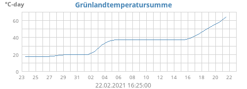
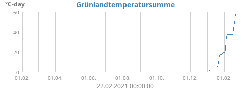
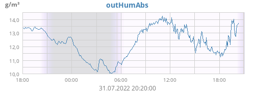
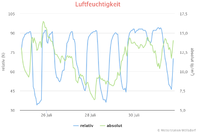
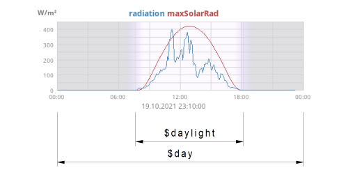

Deutsche Version dieses Textes [hier](https://github.com/roe-dl/weewx-GTS/blob/master/README-de.md)

# weewx-GTS
XType extension for WeeWX to provide 
* "Grünlandtemperatursumme" (a kind of growing degree days) 
* observation types 'dayET' and 'ET24' as the opposite to 'dayRain' and 'rain24'
* observation types for equivalent (potential) temperature, mixing ratio,
  absolute humidity, and (saturation) vapor power
* additional aggregation type for 'radiation' to calculate the total energy received during the aggregation interval
* tags for day boundaries other than midnight local timezone time
* observation types 'yearGDD' and 'seasonGDD'
* aggregation type 'GDD'

## Installation instructions:

1) download

   wget -O weewx-GTS.zip https://github.com/roe-dl/weewx-GTS/archive/master.zip

2) run the installer

   sudo wee_extension --install weewx-GTS.zip

3) check configuration in weewx.conf

   ```
   [StdWXCalculate]
       [[Calculations]]
           ...
           GTS = software,archive
           GTSdate = software, archive
           utcoffsetLMT = software, archive
           dayET = prefer_hardware, archive
           ET24 = prefer_hardware, archive
           yearGDD = software
           seasonGDD = software
           outVaporP = software,loop
           outSVP    = software,loop
           outMixingRatio = software,loop
           outEquiTemp = software,loop
           outThetaE = software,loop
           outHumAbs = software,loop
   ...
   [Engine]
       [[Services]]
           ...
           xtype_services = ... ,user.GTS.GTSService
   ```
   
5) restart weewx

   ```
   sudo /etc/init.d/weewx stop
   sudo /etc/init.d/weewx start
   ```

## Including in skins:

You can use the values provided by this extensions in all skins of WeeWX. You can show the values, and you can create a diagram. The following observation types are provided:

### Grünlandtemperatursumme

"Grünlandtemperatursumme" is a kind of growing degree days that is used
to estimate the start of growing of the plants. For the algorithm see
below.

#### Display values (CheetahGenerator)

* **GTS**: the value of "Grünlandtemperatursumme" itself (example tag: `$current.GTS`)
* **GTSdate**: the date when the GTS value exceeds 200, which is considered the beginning of real spring (example tag: `$day.GTSdate.last.format("%Y-%m-%d")`)
* **utcoffsetLMT**: offfset of the local mean time (Ortszeit) at the station's location
* **LMTtime**: a string showing the local mean time (Ortszeit) at the station's location (can only be used with ".raw", example tag: `$current.LMTtime.raw`)

The values can be used together with every time period defined in the customization guide of WeeWX. There can be used aggregations as well. The following aggregations are defined: "**avg**", "**min**", "**max**", "**last**". Not all time spans are possible. 

See http://weewx.com/docs/customizing.htm#Tags for details on how to use tags in skins.

#### Diagrams (ImageGenerator)

To create diagrams you need to include additional sections into the \[ImageGenerator\] section of skin.conf. What follows are examples. There are more possibilities than that.

Within \[\[month_images\]\]:

```
        [[[monthGTS]]]
            line_gap_fraction = 0.04
            yscale = 0,None,None
            aggregate_type = avg
            [[[[GTS]]]]
                aggregate_interval = 86400
                label = Grünlandtemperatursumme
```

  
Within \[\[year_images\]\]:

```
        [[[yearGTS]]]
            aggregate_type = avg
            [[[[GTS]]]]
                label = Grünlandtemperatursumme
```


These examples create image files named 'monthGTS.png' or 'yearGTS.png', respectively. To display them within the web page appropriate \ tags need to be included for example in index.html.tmpl:
  
```

```
```

```

### Growing degree days

#### Display values (CheetahGenerator)

* **yearGDD**: the sum or integral of growing degrees from the beginning of
  the actual year up to the current time
* **seasonGDD**: the sum or integral of growing degrees from `GTSdate` up to
  the current time. Before `GTSdate` the value is undefined. After October 31st
  it is undefined, too.
* aggregation type **GDD** (or **growdeg**): Used to calculate growing
  degree days for observation types other than `outTemp`. This can be
  every temperature value, say greenhouse temperature.

#### Diagrams (ImageGenerator)

Within \[\[year_images\]\]:

```
        [[[yearGDD]]]
            aggregate_type = avg
            [[[[yearGDD]]]]
                label = Growing degree days
            [[[[seasonGDD]]]]
                label = Season growing degree days
```

This example creates an image files named 'yearGDD.png'. To display it within the web page appropriate \ tags need to be included for example in index.html.tmpl:
  
```

```

You can combine that with GTS:

```
        [[[yearGTS]]]
            aggregate_type = avg
            [[[[GTS]]]]
                label = Grünlandtemperatursumme
            [[[[yearGDD]]]]
                label = Growing degree days
            [[[[seasonGDD]]]]
                label = Season growing degree days
```

To display it within the web page include the appropriate \ tag for example
into index.html.tmpl:
```

```

### Evapotranspiration

#### Display values (CheetahGenerator)

* `dayET`: the sum of ET from the beginning of the archive day on, like dayRain does for rain
* `ET24`: the sum of ET over the last 24 hours, like rain24 does for rain

#### Diagrams (ImageGenerator)

`dayET` and `ET24` are not used in plots.

### Special derived meteorological readings

WeeWX already includes the calculation of some special derived 
meteorological readings, but they are used internally, only. This
extension makes them available for use in section `[StdWXCalculate]`
and in tags.

**Please note**: WeeWX comes with an example extension, that 
calculates a value called "vapor pressure", but it is in fact
saturation vapor pressure. The example uses another algorithm
than WeeWX internally.

**Caution**: The calculation of these values is alpha code. It needs
to be evaluated.

#### Display values (CheetahGenerator)

* `outSVP`: saturation vapor pressure
* `outVaporP`: actual vapor pressure
* `outMixingRatio`: mixing ratio
* `outHumAbs`: absolute humidity
* `outEquiTemp`: equivalent temperature
* `outThetaE`: equivalent potential temperature

#### Diagrams (ImageGenerator)

To show diagrams of these readings there is no need to store them
in database. They will be calculated "on the fly" by the XTYPE system
of WeeWX.

Example: absolute humidity

```
        [[[dayhumabs]]]
            unit = gram_per_meter_cubed
            [[[[outHumAbs]]]]
```


#### Diagrams (Belchertown skin)

Example: Display both the relative and absolute humidity in one diagram

```
    [[humidity]]
        title = "Humidity"
        [[[outHumidity]]]
            name = "relative
        [[[outHumAbs]]]
            name = "absolute"
            yAxis = 1
            unit = gram_per_meter_cubed
            [[[[numberFormat]]]]
                decimals = 1
```



### Radiation energy

'radiation' and 'maxSolarRad' are built-in observation types of WeeWX. 
This extension only
provides an additional aggregation type to them. It is called 
'energy_integral' and calculates the total energy received during the 
aggregation interval.

Note: An Integral is not a sum of observation readings. See below for
algorithm.

#### Display values (CheetahGenerator)

You need to use this aggregation type together with aggregation timespans
like `$day`, `$yesterday`, `$week`, `$month`, and `$year` as well as
timespans defined by some other extension to WeeWX.

`energy_integral` can be used like any other aggregation type like `min`,
`max`, or `sum`.

Example:
`$yesterday.radiation.energy_integral` displays the total sun energy
received the day before.

To display the value in kWh/m^2 instead of Wh/m^2 use:
`$yesterday.radiation.energy_integral.kilowatt_hour_per_meter_squared`

#### Diagrams (ImageGenerator)

Within \[\[month_images\]\]:

```
        [[[monthRadiationEnergy]]]
            line_gap_fraction = 0.04
            #y_label = "Wh/m²"
            [[[[radiation]]]]
                label = "Sonnenenergie (täglich gesamt)"
                data_type = radiation
                aggregate_type = energy_integral
                aggregate_interval = 86400
```

This example creates an image file called 'monthRadiationEnergy.png'
To display it within the web page an appropriate \ tag needs to be included for example in index.html.tmpl:

```

```

#### Diagrams (Belchertown skin)

Belchertown skin uses another plot engine (Highcharts). Therefore the syntax is slightly different.

In section \[month\] or \[year\] of graphs.conf:

```
    [[Sonnenenergie]]
        title = "Sonnenenergie (täglich gesamt)"
        aggregate_type = energy_integral
        aggregate_interval = 86400
        yAxis_label = Energie
        yAxis_label_unit = "Wh/m&sup2;"
        [[[radiation]]]
```

No \ tag is needed.

#### NOAA-like Table

There is an example template to create a text file showing monthly 
summeries of sun energy and sun radiation in the examples directory.
To use it, copy the file to your skin directory and add the following
to your `skin.conf`:

```
[CheetahGenerator]
    ...
    [[SummaryByYear]]
        ...
        [[[sun_year]]]
            encoding = strict_ascii
            template = sun-%Y.txt.tmpl
```

This creates a file for every year that data is available for.

### Special time spans

Sometimes day span used in meteorology are not from midnight to midnight
but start and end at some arbitrary time of day like 09:00 a.m. To
aggregate values with day boundaries other than midnight the following
tags are provided. They are used like standard `$hour`, `$day` etc. 

#### Arbitrary offset to UTC

*  `$offsethour(data_binding=None, hours_ago=0, dayboundary=None)`
*  `$offsetday(data_binding=None, days_ago=0, dayboundary=None)`
*  `$offsetyesterday(data_binding=None, dayboundary=None)`
*  `$offsetmonth(data_binding=None, months_ago=0, dayboundary=None)`
*  `$offsetyear(data_binding=None, years_ago=0, dayboundary=None)`

`dayboundary` is an offset to UTC in seconds, that sets the time of day
to use as the day boundary for the given aggregation. In case of Python
&lt;3.7 the value is rounded to whole minutes. 

#### Local Mean Time of the station location

*  `$LMThour(data_binding=None, hours_ago=0)`
*  `$LMTday(data_binding=None, days_ago=0)`
*  `$LMTyesterday(data_binding=None)`
*  `$LMTmonth(data_binding=None, months_ago=0)`
*  `$LMTyear(data_binding=None, years_ago=0, month_span=None)`

Day boundary is midnight Local Mean Time which is always near
the antitransit of the sun at the station's location.

The optional parameter `month_span` is a time span of several months
within the given year. For example `$LMTyear(month_span=(6,8)).outTemp.avg`
is the average temperature of the summer of the actual year.
`$LMTyear(years_ago=1,month_span=(12,2)).outTemp.max` is the 
maximum temparature of the last winter season.

The attribute `days` can be used together with `$LMTmonth` and `$LMTyear`
for iteration.

#### Daylight timespan



* `$daylight(data_binding=None, days_ago=0)`: timespan from sunrise to
   sunset
* `$LMTmonth(data_binding=None, months_ago=0).daylights`: series of 
   timespans describing the timespan from sunrise to sunset for each
   individual day. For use in `#for` loops
* `$LMTyear(data_binding=None, months_ago=0).daylights`: series of 
   timespans describing the timespan from sunrise to sunset for each
   individual day. For use in `#for` loops

Examples:

* average temperature while the sun is up
  ```
  $daylight.outTemp.avg
  ```
* table with day of month and the average temperature while the sun
  is up on that day
  ```
  #for $span in $LMTmonth.daylights
  <p>$span.dateTime.format("%d"): $span.outTemp.avg</p>
  #end for
  ```

## Algorithm:

### Grünlandtemperatursumme (GTS)

* GTS is calculated from the daily average temperatures. If the daily average temperature is above 0°C (32°F) it is used to add to the sum, otherwise it is discarded.
* In January the daily average temperatures are multiplied by 0.5.
* In February the daily average temperatures are multiplied by 0.75.
* From March on the daily average temperatures are used as is.
* To get the GTS value of a day all the values as described above are added from January 1st to the day in question. So the GTS value increases in time.
* If the GTS value exceeds 200 this event is considered the beginning of growing of the plants in spring.
* The GTS value itself is calculated up to May 31st. The end value is considered a statement about the spring.

### Radiation energy

Radiation energy is calculated as follows: All the radiation readings
within the aggregation interval are multiplied by their respective
archive interval. That is based on the assumption that the radiation
was constant during that interval. The error resulting form that is
considered small enough to tolerate.

After that all the products of radiation and time interval are summarized
together.

While the unit label of the radiation reading is W/m^2, the unit label
of the radiation energy is Wh/m^2.

## Sources:

* http://www.groitzsch-wetter.de/HP/green1.html
* http://www.regionalwetter-sa.de/sa_gruenland.php
* WeeWX examples/stats.py

## Links:

* [WeeWX homepage](http://weewx.com) - [WeeWX Wiki](https://github.com/weewx/weewx/wiki)
* [Belchertown skin homepage](https://obrienlabs.net/belchertownweather-com-website-theme-for-weewx/) - [Belchertown skin Wiki](https://github.com/poblabs/weewx-belchertown/wiki)
* [Wöllsdorf weather conditions](https://www.woellsdorf-wetter.de)
